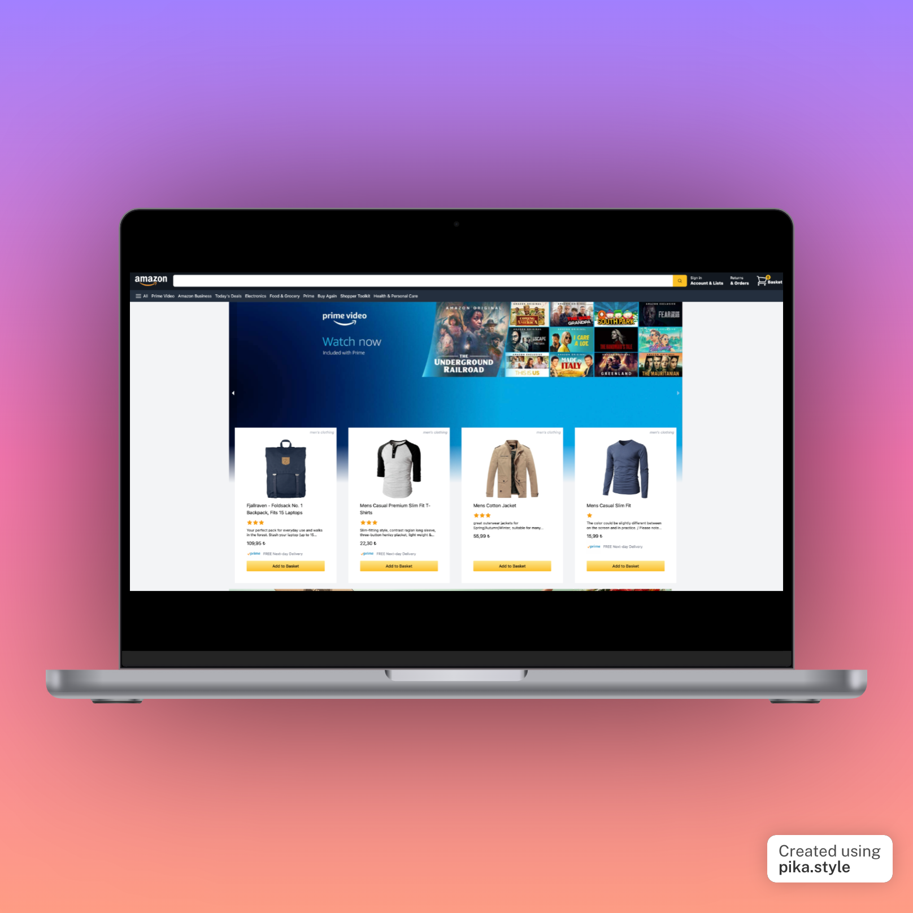

# Amazon Clone

This is a full-stack web application that aims to replicate the functionality of the popular online shopping platform, Amazon. The project utilizes a variety of technologies, including:

- **Next.js** for server-rendered React application development
- **Redux** for state management
- **Stripe** for handling checkout and payments
- **Tailwind CSS** for styling
- **Firebase** for database and authentication
- **Next-Auth** for user authentication and authorization

Users can browse through products and add them to their basket. If they are logged in, they can proceed to the checkout page where they can make a payment using Stripe. After the checkout, they can see their orders in the Orders page.

# LIVE Demo

You can check out the live demo of this application in Vercel by clicking this [link](https://amazon-clone-eevmx78b0-braveheart-tex.vercel.app/).

## Getting Started

1. Clone the repository

- `git clone https://github.com/yourusername/amazon-clone.git`

2. Install dependencies

- `npm install`

3. Start the development server

- `npm run dev`

4. Open http://localhost:3000 to view the application in the browser.

## Deployment

This project is ready to be deployed to a variety of platforms, such as Vercel, Heroku or Firebase. But I choose Vercel because of its simplicity when it comes to Next.js apps.

## Authors

Bora Karaca - <i>Initial work</i>

## License

This project is licensed under the MIT License.

## Acknowledgments

- Inspiration: Amazon
- Next.js, Redux, Stripe, Tailwind CSS, Firebase, Next-Auth documentation.
